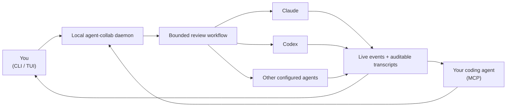

# agent-collab

[](https://github.com/lauriparviainen/agent_collab/actions/workflows/ci.yml)

**Cross-vendor review loops for AI-generated code. Generation is cheap. Review
is the bottleneck.**

My coding agents produce more code than I can reliably review. I stopped
pretending that another pass from the same model solves that problem. So I
spend my limited human attention on the critical paths — and, only half
joking, close my eyes on the rest and let agents from different vendors fight
it out.

`agent-collab` is the bandaid I use: it gives agents from different vendors
bounded turns to inspect the same work, streams what they do, and leaves a
transcript a human can audit. In my experience, agents from different vendors
approach the same code from different angles and find different issues, making
the combined review more useful. Their disagreements also expose assumptions
worth checking. Research on
[diverse-model collaboration](https://aclanthology.org/2024.acl-long.381/) and
[aggregating independent code reviews](https://arxiv.org/abs/2509.01494) points
in the same direction, though it does not prove that this particular workflow
is generally better. It does not make AI review sufficient.

> The bet is simple: coverage comes from disagreement, not just more passes.

## How it fits together



There are two ways in: you drive the daemon from the terminal with the CLI and
TUI, and your coding agent reaches the same daemon through MCP. Either way the
daemon owns each session and runs the selected workflow. Provider backends
launch the configured agents, while every result returns through one event
stream and is saved as JSONL and readable Markdown. See the
[architecture guide](doc/daemon-architecture.md) for the detailed design.

## Install

You need Python 3.10 or newer.

```bash
git clone https://github.com/lauriparviainen/agent_collab.git
cd agent_collab
python3 -m venv .venv
source .venv/bin/activate
python -m pip install -e .
```

A Docker image is planned but not available yet.

## Give your coding agent a second opinion

The most useful setup is MCP: your current coding agent can ask another vendor's
agent to inspect its work before it finishes.

Start the local daemon:

```bash
agent-collab daemon start
```

Then configure your MCP client to launch the stdio adapter. For example, in
Codex configuration:

```toml
[mcp_servers.agent_collab]
command = "/absolute/path/to/agent_collab/.venv/bin/python"
args = ["-m", "agent_collab.mcp_server"]
cwd = "/absolute/path/to/agent_collab"
startup_timeout_sec = 10
tool_timeout_sec = 60
enabled = true
```

Now ask your coding agent:

> Use agent-collab to get a second opinion on the current diff. Have the
> reviewers focus on correctness, security, regressions, and missing tests.

The agent can discover the configured reviewers, start the session, follow its
events, and bring the findings back into the conversation you already have.
You do not need to learn a second interactive tool to use it.

## See it work without provider accounts

Run a simulated session from the terminal. This makes no model call:

```bash
agent-collab --mock --workdir . \
  "Review this repository and identify the highest-risk change"
```

You will see the referee hand the task between agents and print each event as
it happens. A readable Markdown transcript and the original JSONL events are
written under `~/.agent-collab/data/sessions/`.

## Run a real cross-review

The default `cross-review` workflow is:

```text
Claude drafts/reviews → Codex challenges → Claude revises
```

Install and sign in to the Claude Code and Codex CLIs, then point the session at
code you care about:

```bash
agent-collab --workflow cross-review --workdir /path/to/project \
  "Review the current git diff. Prioritize correctness, security, and missing tests."
```

The agents run in the selected project directory. They can inspect the actual
repository rather than receiving a pasted excerpt, and the bounded workflow
ends after the configured turns.

Already use only one provider? The built-in `solo-claude` and `solo-codex`
workflows are useful for supervised runs, but the cross-vendor review idea is
the reason this project exists.

## Keep sessions running

One-shot mode is the shortest path. The local daemon adds persistent sessions,
an interactive terminal UI, and access from MCP clients:

```bash
agent-collab daemon start

agent-collab start --watch --workdir /path/to/project \
  "Review the current changes and call out anything I should not ship"

agent-collab tui
```

One daemon can serve many projects. Every session carries its own `workdir`,
which selects project configuration and becomes the agents' working directory.

## What you get

- **Different reviewers, one bounded session.** Workflows define exactly which
  agents run and in what order.
- **Visible execution.** Messages, tool calls, commands, status, and errors are
  normalized into one event stream.
- **Evidence after the terminal closes.** Every session writes JSONL and
  Markdown transcripts.
- **Local session control.** The daemon binds to loopback by default and keeps
  its state under `~/.agent-collab/`.
- **CLI, TUI, and MCP access.** Humans and editor agents can observe the same
  daemon-owned sessions.
- **Provider choice without a central hard-coded option table.** Each backend
  owns its option schema, validation, health checks, and command preview.

## Integrations and backends

Each provider is supported through two backends: `cli` runs the provider's own
command-line tool as a subprocess, and `sdk` calls its Python SDK in-process.

| Provider | CLI backend | SDK backend | Enabled by default |
| --- | --- | --- | --- |
| Claude (Claude Code) | `claude_cli` | `claude_sdk` | yes |
| Codex | `codex_cli` | `codex_sdk` | yes |
| Google Antigravity (a harness, not a model vendor) | `antigravity_cli` | `antigravity_sdk` | opt-in |
| xAI (Grok Build CLI, remote chat SDK) | `xai_cli` | `xai_sdk` | opt-in |

Claude and Codex power the built-in workflows; Antigravity and xAI are opt-in
so a clean install does not pretend credentials or local runtimes exist.

See [agent configuration](doc/agent-configuration.md) for provider setup,
backend selection, typed options, custom agents, and custom workflows. Each
backend also documents itself in `agent_collab/backends/<provider>_<backend>/README.md`.

## Cost, privacy, and honest limits

- `agent-collab` does not provide or broker model accounts. Each provider CLI
  or SDK needs its own credentials.
- A workflow with three agent turns consumes roughly three turns' worth of
  provider usage. Start with Claude and Codex before adding more reviewers.
- The daemon is local, but the provider tools it launches may send prompts and
  repository content to their vendors. Their data policies still apply.
- Agent review is advisory. It does not replace understanding critical code,
  tests, security review, or human accountability.
- Different vendors can still make the same mistake. This project makes the
  disagreement inspectable; it does not guarantee it.
- Antigravity is a harness, not a model vendor. It can run Gemini, Claude, or
  other supported models, so check the selected model before calling a workflow
  cross-vendor.
- This is an active prototype. Capability flags and health checks are reported
  conservatively rather than inferred from a provider name.
- The repository does not yet carry an open-source license. Until one is
  added, treat the code as source-available for evaluation rather than open
  source.

Configuration can be global or project-specific. The daemon's `options` command
reports effective workflows, selected backends, accepted values, health
evidence, and remediation without making a model call. See
[agent configuration](doc/agent-configuration.md) and
[MCP guidance](doc/mcp-guidance.md) for the complete setup and tool contract.

## Built alongside David AI

`agent-collab` is a small, inspectable project about one problem: how to get
more useful review when agents produce more code than a person can read.

I also build [David AI](https://ai.david.fi/), its larger sister project. David
AI is a governed, self-hosted platform for connecting agents to the systems a
company actually runs—tickets, knowledge, cloud, and infrastructure—while
credentials, scopes, risky-action approvals, and audit trails stay under human
control.

They share the same starting point: models are increasingly capable; the
difficult part is building the control, review, and trust around them.

`agent-collab` stands on its own and does not require David AI. In the other
direction an integration is in progress: David AI is gaining the ability to
link running agent-collab daemons — eventually several — so its users can call
their review tools from the governed platform. Until that ships, treat the two
as separate projects.

Built by [Lauri Parviainen](https://github.com/lauriparviainen).

## Documentation

The README is deliberately short. Detailed behavior lives here:

- [Agent and backend configuration](doc/agent-configuration.md)
- [Runtime files and config precedence](doc/runtime-layout.md)
- [Daemon, sessions, CLI, and MCP architecture](doc/daemon-architecture.md)
- [MCP tool guidance](doc/mcp-guidance.md)
- [Generated HTTP API reference](doc/daemon_api_doc/http-api.md)
- [Development and verification](doc/development.md)
- [Current implementation notes](doc/implementation-notes.md)
- [Design and task index](doc/README.md)

## Development

From a source checkout:

```bash
./agent_collab.sh test
./agent_collab.sh setup --check
```

Two additional checks serve different purposes:

```bash
./agent_collab.sh smoke
./agent_collab.sh integration-test claude_cli
```

`smoke` is a fast mock session: no credentials, no model call. `integration-test`
runs a real provider/backend transport check and may require credentials or
incur provider usage. See [development notes](doc/development.md) before running
live integrations.
