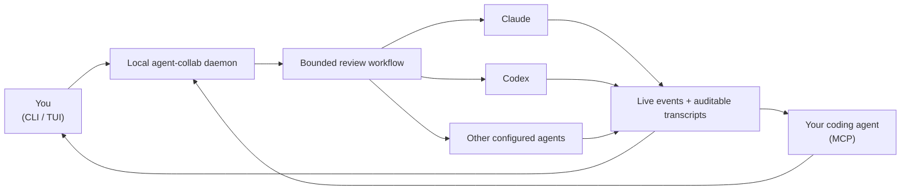

# agent-collab

[](https://github.com/lauriparviainen/agent_collab/actions/workflows/ci.yml)

**Cross-vendor review loops for AI-generated code. Generation is cheap. Review
is the bottleneck.**

My coding agents produce more code than I can reliably review. I stopped
pretending that another pass from the same model solves that problem. So I
spend my limited human attention on the critical paths — and, only half
joking, close my eyes on the rest and let agents from different vendors fight
it out.

`agent-collab` is the bandaid I use: it gives agents from different vendors
bounded turns to inspect the same work, streams what they do, and leaves a
transcript a human can audit. In my experience, agents from different vendors
approach the same code from different angles and find different issues, making
the combined review more useful. Their disagreements also expose assumptions
worth checking. Research on
[diverse-model collaboration](https://aclanthology.org/2024.acl-long.381/) and
[aggregating independent code reviews](https://arxiv.org/abs/2509.01494) points
in the same direction, though it does not prove that this particular workflow
is generally better. It does not make AI review sufficient.

> The bet is simple: coverage comes from disagreement, not just more passes.

## How it fits together



There are two ways in: you drive the daemon from the terminal with the CLI and
TUI, and your coding agent reaches the same daemon through MCP. Either way the
daemon owns each session and runs the selected workflow. Provider backends
launch the configured agents, while every result returns through one event
stream and is saved as JSONL and readable Markdown. See the
[architecture guide](doc/daemon-architecture.md) for the detailed design.

## Install

You need Python 3.10 or newer.

```bash
git clone https://github.com/lauriparviainen/agent_collab.git
cd agent_collab
./agent_collab.sh install
```

This installs the current checkout into `~/.agent-collab/venv` and exposes the
`agent-collab` console command through `~/.local/bin`. Install takes no
options and narrates each step: what it did and whether it succeeded. If
`~/.local/bin` is not on `PATH`, the installer prints the change you need to
make; it never edits shell startup files, and it refuses to replace an
unrelated command (the error tells you exactly what to remove).

You can now run the TUI or other commands from any directory:

```bash
agent-collab tui
agent-collab --help
```

> **Two entry points — know which one you are typing.**
> `./agent_collab.sh` (underscore) is the checkout script: use it for
> `install`, `uninstall`, and upgrading after `git pull` — typically nothing
> else. `agent-collab` (hyphen) is the installed command for everyday use:
> the daemon, sessions, the TUI, and configuration. The installed command
> deliberately has no `install` subcommand; if you type `agent-collab
> install` it tells you where to go instead.

The helper installs every provider SDK (the `all` extra) so the `sdk` backends
work out of the box. A plain `pip install` of the package is SDK-free — the
`cli` backends drive the provider command-line tools and need no vendor SDK —
and enables `sdk` backends through per-provider extras:

```bash
pip install 'agent-collab[claude]'       # claude_sdk
pip install 'agent-collab[codex]'        # codex_sdk
pip install 'agent-collab[antigravity]'  # antigravity_sdk
pip install 'agent-collab[xai]'          # xai_sdk
pip install 'agent-collab[all]'          # everything
```

A missing SDK never crashes the daemon: the backend reports itself unavailable
with the matching install hint.

## Upgrade

Install is also the upgrade command. After every `git pull`, re-run it:

```bash
git pull
./agent_collab.sh install
```

Each run reinstalls the checkout into the venv, migrates your user config to
the current schema (a `config.toml.bak` backup is written first; comments and
formatting are preserved), and restarts the daemon if it was running before
install. Restarting interrupts active sessions; session history under
`~/.agent-collab/data` and all configuration are preserved. If your config
has a problem, install is where you hear about it, as a plain warning or
error with the file path.

## Uninstall

```bash
./agent_collab.sh uninstall
```

This stops the daemon, disables autostart, removes `~/.agent-collab/venv` and
the `~/.local/bin/agent-collab` command. Your configuration and session data
under `~/.agent-collab` are kept; the command prints the path so you can
delete it yourself if you want everything gone.

As a standard packaging alternative, `pipx install '.[all]'` also installs
the declared console commands in an isolated environment. A Docker image is
planned but not available yet.

## Give your coding agent a second opinion

The most useful setup is MCP: your current coding agent can ask another vendor's
agent to inspect its work before it finishes.

Start the local daemon:

```bash
agent-collab daemon start
```

On Linux with a systemd user manager, you can instead register the daemon to
start with your login session:

```bash
agent-collab daemon autostart enable
agent-collab daemon autostart status
```

The service uses the durable installed command, so run
`./agent_collab.sh install` first. Enabling autostart is a separate opt-in step:
installation alone never starts or registers a service. Disable it without
removing configuration or transcripts:

```bash
agent-collab daemon autostart disable
```

This is login-time startup. The command deliberately does not enable systemd
"lingering," which would run the user manager from boot before login. Users who
need that machine-level policy can enable it separately with
`loginctl enable-linger "$USER"` after considering credential availability and
resource use. macOS LaunchAgent registration is not yet supported.

On first start the daemon generates a permanent bearer token into
`~/.agent-collab/config.toml`; it stays valid across daemon restarts (see
[runtime layout](doc/runtime-layout.md) for the semantics and rotation).

Then register agent-collab with your MCP client. **Direct Streamable HTTP is
the preferred transport**: it connects the client straight to the daemon and
does not need a per-client adapter process. The daemon must be running first:

```bash
agent-collab daemon start
```

For Claude Code, pass the permanent token as an HTTP header:

```bash
claude mcp add --transport http agent-collab http://127.0.0.1:8765/mcp \
  --header "Authorization: Bearer <your [daemon].token value>"
```

For Codex, configure the same Streamable HTTP URL and header. The
[`http_headers` setting](https://learn.chatgpt.com/docs/config-file/config-reference#configtoml)
is part of Codex's MCP HTTP configuration:

```toml
[mcp_servers.agent_collab]
url = "http://127.0.0.1:8765/mcp"
http_headers = { Authorization = "Bearer <your [daemon].token value>" }
tool_timeout_sec = 60
enabled = true
```

These client configurations contain a credential; keep them private. Codex
also supports `bearer_token_env_var` or `env_http_headers` if you prefer to
source the token from the environment instead of storing it in `config.toml`.

If you do not want to configure direct HTTP headers, use the secondary stdio
adapter. It reads the daemon URL and token from the agent-collab configuration
and still requires the daemon to be running. In Claude Code:

```bash
claude mcp add agent-collab -- agent-collab mcp
```

Or in Codex configuration:

```toml
[mcp_servers.agent_collab]
command = "agent-collab"
args = ["mcp"]
startup_timeout_sec = 10
tool_timeout_sec = 60
enabled = true
```

Now ask your coding agent:

> Use agent-collab to get a second opinion on the current diff. Have the
> reviewers focus on correctness, security, regressions, and missing tests.

The agent can discover the configured reviewers, start the session, follow its
events, and bring the findings back into the conversation you already have.
You do not need to learn a second interactive tool to use it.

### Install the review skills

This repository ships two thin skills:

- `agent-collab-solo-review` runs one independent review (one provider turn).
- `agent-collab-dual-review` runs two reviewers concurrently and has the
  calling agent reconcile their findings (two provider turns).

Both require agent-collab to be installed, the daemon to be running, and its
MCP server to be registered as described above. They ask you to select a
reviewer model when the request is ambiguous and show the effective models,
backends, and options for confirmation before making provider calls.

Claude Code can install both from this repository's marketplace:

```text
/plugin marketplace add lauriparviainen/agent_collab
/plugin install agent-collab@agent-collab
```

The universal fallback is to copy both directories under `skills/` into the
client's user skill directory:

| Client | User skill directory |
| --- | --- |
| Claude Code | `~/.claude/skills/` |
| Codex | `~/.agents/skills/` |
| Antigravity | `~/.gemini/antigravity/skills/` |
| Grok | `~/.grok/skills/` |

For example, for Codex:

```bash
cp -R skills/agent-collab-solo-review skills/agent-collab-dual-review \
  ~/.agents/skills/
```

The installer deliberately does not copy skills into another tool's config
directory. Skill installation is a separate, explicit choice.

## See it work without provider accounts

Run a simulated session from the terminal. This makes no model call:

```bash
agent-collab --mock --workdir . \
  "Review this repository and identify the highest-risk change"
```

You will see the referee hand the task between agents and print each event as
it happens. A readable Markdown transcript and the original JSONL events are
written under `~/.agent-collab/data/sessions/`.

## Run a real cross-review

The default `cross-review` workflow is:

```text
Claude drafts/reviews → Codex challenges → Claude revises
```

Install and sign in to the Claude Code and Codex CLIs, then point the session at
code you care about:

```bash
agent-collab --workflow cross-review --workdir /path/to/project \
  "Review the current git diff. Prioritize correctness, security, and missing tests."
```

The agents run in the selected project directory. They can inspect the actual
repository rather than receiving a pasted excerpt, and the bounded workflow
ends after the configured turns.

Already use only one provider? The built-in `solo-claude` and `solo-codex`
workflows are useful for supervised runs, but the cross-vendor review idea is
the reason this project exists.

## Run independent reviews in parallel

The built-in `dual-review` workflow starts Claude and Codex concurrently over
the same frozen task context. The daemon merges both reviewers' attributed
events into one cursor stream and emits one structured stage summary when they
settle:

```bash
agent-collab start --workflow dual-review --watch --workdir /path/to/project \
  "Independently review the current diff for correctness, security, and missing tests."
```

Parallel reviews are non-interactive. Each reviewer has its own turn deadline;
one runtime failure degrades the group instead of discarding a completed peer
review. The session is `done` when at least one reviewer completed and produced
a message, and `failed` when none did. The calling human or agent remains the
reconciler—it should inspect the stage summary and decide which findings to
accept.

## Keep sessions running

One-shot mode is the shortest path. The local daemon adds persistent sessions,
an interactive terminal UI, and access from MCP clients:

```bash
agent-collab daemon start

agent-collab start --watch --workdir /path/to/project \
  "Review the current changes and call out anything I should not ship"

agent-collab tui
```

One daemon can serve many projects. Every session carries its own `workdir`,
which selects project configuration and becomes the agents' working directory.
Project config may rename globally known agents and compose workflows, but all
execution-relevant agent settings remain global-user-only. An optional global
`[workdir].restrict_workdir_roots` list can confine sessions while still listing a
specific exceptional directory. Omitting the key is unrestricted; an empty list
also means no restriction.

## What you get

- **Different reviewers, one bounded session.** Workflows define exactly which
  agents run sequentially or in one concurrent review group.
- **Visible execution.** Messages, tool calls, commands, status, and errors are
  normalized into one event stream.
- **Explicit turn results.** Every new backend invocation records one
  `completed`, `cancelled`, `interrupted`, `timed_out`, `refused`, or `failed`
  outcome. Session detail and event polling expose the packed turn history and
  a canonical structured failure; clients never need to infer success from
  provider prose or process exit.
- **Evidence after the terminal closes.** Every session writes JSONL and
  Markdown transcripts. Finished sessions are kept for 30 days by default;
  set `[sessions] retention_days` in the user config to keep them longer, or
  `0` to disable automatic pruning, and use `agent-collab sessions prune` to
  preview or clean up manually.
- **Local session control.** The daemon binds to loopback by default and keeps
  its state under `~/.agent-collab/`.
- **CLI, TUI, and MCP access.** Humans and editor agents can observe the same
  daemon-owned sessions.
- **Provider choice without a central hard-coded option table.** Each backend
  owns its option schema, validation, health checks, and command preview.

## Integrations and backends

Each provider is supported through two backends: `cli` runs the provider's own
command-line tool as a subprocess, and `sdk` calls its Python SDK in-process.
The `cli` backends work with the base install; each `sdk` backend needs its
provider's optional dependency extra (see [Install](#install)).

> **SDK status:** The SDK backends are experimental. Basic in-process turns and
> provider-session identity work, but native session resume, provider-confirmed
> interruption, and interactive tool approval are not fully implemented;
> capability flags remain conservative. Follow the design refresh and full SDK
> capability work in [issue #20](https://github.com/lauriparviainen/agent_collab/issues/20).

| Provider | CLI backend | SDK backend | Enabled by default |
| --- | --- | --- | --- |
| Claude (Claude Code) | `claude_cli` | `claude_sdk` | yes |
| Codex | `codex_cli` | `codex_sdk` | yes |
| Google Antigravity (a harness, not a model vendor) | `antigravity_cli` | `antigravity_sdk` | opt-in |
| xAI (Grok Build CLI, remote chat SDK) | `xai_cli` | `xai_sdk` | opt-in |

Claude and Codex power the built-in workflows; Antigravity and xAI are opt-in
so a clean install does not pretend credentials or local runtimes exist.

See [agent configuration](doc/agent-configuration.md) for provider setup,
backend selection, typed options, custom agents, and custom workflows. Each
backend also documents itself in `agent_collab/backends/<provider>_<backend>/README.md`.

## Cost, privacy, and honest limits

- `agent-collab` does not provide or broker model accounts. Each provider CLI
  or SDK needs its own credentials.
- A workflow with three agent turns consumes roughly three turns' worth of
  provider usage. Parallel groups also run those turns concurrently. Start
  with Claude and Codex before adding more reviewers.
- The daemon is local, but the provider tools it launches may send prompts and
  repository content to their vendors. Their data policies still apply.
- The daemon is not a durable archive by default: terminal sessions older than
  30 days are pruned automatically. Raise `[sessions] retention_days` in
  `~/.agent-collab/config.toml` (or set it to `0` to disable pruning) before
  relying on old transcripts as evidence. Only transcripts inside the managed
  `data/sessions/` directory are ever deleted; running sessions and custom log
  directories are never touched.
- Agent review is advisory. It does not replace understanding critical code,
  tests, security review, or human accountability.
- Different vendors can still make the same mistake. This project makes the
  disagreement inspectable; it does not guarantee it.
- Antigravity is a harness, not a model vendor. It can run Gemini, Claude, or
  other supported models, so check the selected model before calling a workflow
  cross-vendor.
- This is an active prototype. Capability flags and health checks are reported
  conservatively rather than inferred from a provider name.

Configuration can be global or project-specific. The daemon's `options` command
reports effective workflows, selected backends, accepted values, health
evidence, and remediation without making a model call. See
[agent configuration](doc/agent-configuration.md) and
[MCP guidance](agent_collab/mcp-guidance.md) for the complete setup and tool contract.

## Built alongside David AI

`agent-collab` is a small, inspectable project about one problem: how to get
more useful review when agents produce more code than a person can read.

I also build [David AI](https://ai.david.fi/), its larger sister project. David
AI is a governed, self-hosted platform for connecting agents to the systems a
company actually runs—tickets, knowledge, cloud, and infrastructure—while
credentials, scopes, risky-action approvals, and audit trails stay under human
control.

They share the same starting point: models are increasingly capable; the
difficult part is building the control, review, and trust around them.

`agent-collab` stands on its own and does not require David AI. In the other
direction an integration is in progress: David AI is gaining the ability to
link running agent-collab daemons — eventually several — so its users can call
their review tools from the governed platform. Until that ships, treat the two
as separate projects.

Built by [Lauri Parviainen](https://github.com/lauriparviainen).

## Documentation

The README is deliberately short. Detailed behavior lives here:

- [Agent and backend configuration](doc/agent-configuration.md)
- [Runtime files and config precedence](doc/runtime-layout.md)
- [Daemon, sessions, CLI, and MCP architecture](doc/daemon-architecture.md)
- [MCP tool guidance](agent_collab/mcp-guidance.md)
- [Generated HTTP API reference](doc/daemon_api_doc/http-api.md)
- [Development and verification](doc/development.md)
- [Current implementation notes](doc/implementation-notes.md)
- [Design and task index](doc/README.md)

## Development

From a source checkout:

```bash
./agent_collab_dev.sh test
./agent_collab_dev.sh build --check
```

Two additional checks serve different purposes:

```bash
./agent_collab_dev.sh smoke
./agent_collab_dev.sh integration-test claude_cli
```

`smoke` is a fast mock session: no credentials, no model call. `integration-test`
runs a real provider/backend transport check and may require credentials or
incur provider usage. See [development notes](doc/development.md) before running
live integrations.

## Contributing and security

Pull requests are welcome; [CONTRIBUTING.md](CONTRIBUTING.md) covers the
required checks and conventions. Report vulnerabilities privately as described
in [SECURITY.md](SECURITY.md).

## License

`agent-collab` is licensed under the [Apache License 2.0](LICENSE).
